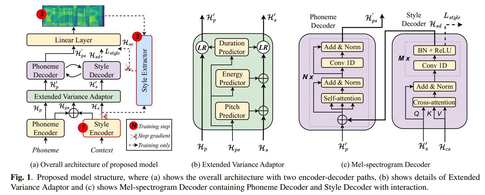
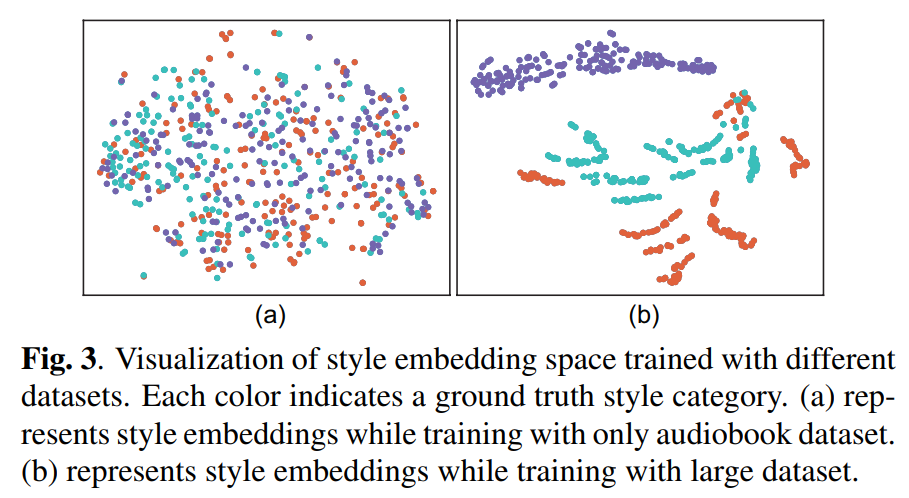

(Submitted on ICASSP 2024)

 <b>Authors</b>: <i>Xueyuan Chen, Xi Wang, Shaofei Zhang, Lei He, Zhiyong Wu, Xixin Wu, Helen Meng</i> 

## 1. Abstract

The expressive quality of synthesized speech for audiobooks is limited by generalized model architecture and unbalanced style distribution in the training data. To address these issues, in this paper, we propose a self-supervised style enhancing method with VQ-VAE-based pre-training for expressive audiobook speech synthesis. Firstly, a text style encoder is pre-trained with a large amount of unlabeled text-only data. Secondly, a spectrogram style extractor based on VQ-VAE is pre-trained in a self-supervised manner, with plenty of audio data that covers complex style variations. Then a novel architecture with two encoder-decoder paths is specially designed to model the pronunciation and high-level style expressiveness respectively, with the guidance of the style extractor. Both objective and subjective evaluations demonstrate that our proposed method can significantly improve the naturalness and expressiveness of the synthesized speech in audiobook synthesis especially for the role and out-of-domain scenarios.

## 2. Proposed model architecture

## 3. Synthesized audio of single sentence

3.1. **Text**：*“你难道不是曾经怀孕过的女人吗？”*

   *("Aren't you a woman who was pregnant before?")*

   

<table class="custom-table">
  <thead>
  <tr>
    <th>FastSpeech 2</th>
    <th>FS2-CADEC</th>
    <th>Proposed</th>
  </tr>
  </thead>
  <tbody>
  <tr>
    <td><audio controls><source src="./wavs/fs2/01.wav" type="audio/wav"></audio></td>
    <td><audio controls><source src="./wavs/fs2-cadec/01.wav" type="audio/wav"></audio></td>
    <td><audio controls><source src="./wavs/proposed/01.wav" type="audio/wav"></audio></td>
  </tr>
  </tbody>
</table>

3.2. **Text**：*“你敢说没有？”*

   *("How dare you say no?")*

   <table class="custom-table">
  <thead>
  <tr>
    <th>FastSpeech 2</th>
    <th>FS2-CADEC</th>
    <th>Proposed</th>
  </tr>
  </thead>
  <tbody>
  <tr>
    <td><audio controls><source src="./wavs/fs2/02.wav" type="audio/wav"></audio></td>
    <td><audio controls><source src="./wavs/fs2-cadec/02.wav" type="audio/wav"></audio></td>
    <td><audio controls><source src="./wavs/proposed/02.wav" type="audio/wav"></audio></td>
  </tr>
  </tbody>
</table>
   
3.3. **Text**：*“没有事情就不能给你打电话？”*

   *("Can't I call you if I have nothing to do?")*

   <table class="custom-table">
  <thead>
  <tr>
    <th>FastSpeech 2</th>
    <th>FS2-CADEC</th>
    <th>Proposed</th>
  </tr>
  </thead>
  <tbody>
  <tr>
    <td><audio controls><source src="./wavs/fs2/03.wav" type="audio/wav"></audio></td>
    <td><audio controls><source src="./wavs/fs2-cadec/03.wav" type="audio/wav"></audio></td>
    <td><audio controls><source src="./wavs/proposed/03.wav" type="audio/wav"></audio></td>
  </tr>
  </tbody>
</table>
   
3.4. **Text**：*“丫头,你以前不是……”*

   *("Girl, you were not...")*

   <table class="custom-table">
  <thead>
  <tr>
    <th>FastSpeech 2</th>
    <th>FS2-CADEC</th>
    <th>Proposed</th>
  </tr>
  </thead>
  <tbody>
  <tr>
    <td><audio controls><source src="./wavs/fs2/04.wav" type="audio/wav"></audio></td>
    <td><audio controls><source src="./wavs/fs2-cadec/04.wav" type="audio/wav"></audio></td>
    <td><audio controls><source src="./wavs/proposed/04.wav" type="audio/wav"></audio></td>
  </tr>
  </tbody>
</table>
   
3.5. **Text**：*“紧张吗？”*

   *("Nervous?")*

   <table class="custom-table">
  <thead>
  <tr>
    <th>FastSpeech 2</th>
    <th>FS2-CADEC</th>
    <th>Proposed</th>
  </tr>
  </thead>
  <tbody>
  <tr>
    <td><audio controls><source src="./wavs/fs2/05.wav" type="audio/wav"></audio></td>
    <td><audio controls><source src="./wavs/fs2-cadec/05.wav" type="audio/wav"></audio></td>
    <td><audio controls><source src="./wavs/proposed/05.wav" type="audio/wav"></audio></td>
  </tr>
  </tbody>
</table>
   
3.6. **Text**：*“你怎么进来的？”*

   *("How did you get in here?")*

   <table class="custom-table">
  <thead>
  <tr>
    <th>FastSpeech 2</th>
    <th>FS2-CADEC</th>
    <th>Proposed</th>
  </tr>
  </thead>
  <tbody>
  <tr>
    <td><audio controls><source src="./wavs/fs2/06.wav" type="audio/wav"></audio></td>
    <td><audio controls><source src="./wavs/fs2-cadec/06.wav" type="audio/wav"></audio></td>
    <td><audio controls><source src="./wavs/proposed/06.wav" type="audio/wav"></audio></td>
  </tr>
  </tbody>
</table>

 

## 4. Synthesized audio of short paragraph

4.1. **Text**：*玄舞还没开口,玄迩就说话了,"姑娘,属下过来时姜公曾有吩咐,说三爷之前曾传了话,若是您今日进城见了田守一,让您想怎么办就怎么办,不必有任何顾忌。" 小暖又问, "你抓住的那几个对守一动刑的畜生呢?" "有两个在属下这里,剩下的在四皇子手中。" 玄迩答道, "因时间仓促,属下还未来得及审问。"*

   *(Before Xuan Wu could say, Xuan Er said, "Girl, when this subordinate came over, Mr. Jiang had given an order, saying that the third master had passed on a message before, if you go to the city today and meet Tian Shouyi, you can do whatever you want, without any scruples." Xiao Nuan asked again, "Where are the brutes that you caught to guard the mob?" "Two of them are here, and the rest are in the hands of the Fourth Prince." Xuan Er replied, "Due to the rush of time, the subordinates have not had time to interrogate.")*

<table class="custom-table">
  <thead>
  <tr>
    <th>FastSpeech 2</th>
    <th>FS2-CADEC</th>
    <th>Proposed</th>
  </tr>
  </thead>
  <tbody>
  <tr>
    <td><audio controls><source src="./wavs/fs2/p01.wav" type="audio/wav"></audio></td>
    <td><audio controls><source src="./wavs/fs2-cadec/p01.wav" type="audio/wav"></audio></td>
    <td><audio controls><source src="./wavs/proposed/p01.wav" type="audio/wav"></audio></td>
  </tr>
  </tbody>
</table>
   
4.2. **Text**：*郑副司令身后有人在他耳边耳语了几句,他听了呵呵一笑,转身对少将说，“听说九月份, 你那儿有一批人要退伍转业?”“先别着急退伍,让他们来我们军区再待两年。到时候我给他们提上两级,再转业对他们也有好处。你看看怎么样?” 少将听了微微一笑,没有丝毫犹豫就说，“没问题,他们就靠郑司令您费心了。”*

   *(Someone behind Deputy Commander Zheng whispered a few words in his ear. He laughed and turned to the major general and said, "I heard that in September, a group of people from your place will be discharged from the army and change jobs?" "Don't be in a hurry to leave the army, let them come our military region and stay for another two years. At that time, I will promote them to two levels, and it will be good for them to change jobs. What do you think?" The major general smiled and said without hesitation, "No problem, they will rely on Commander Zheng, please worry about it.")*

<table class="custom-table">
  <thead>
  <tr>
    <th>FastSpeech 2</th>
    <th>FS2-CADEC</th>
    <th>Proposed</th>
  </tr>
  </thead>
  <tbody>
  <tr>
    <td><audio controls><source src="./wavs/fs2/p02.wav" type="audio/wav"></audio></td>
    <td><audio controls><source src="./wavs/fs2-cadec/p02.wav" type="audio/wav"></audio></td>
    <td><audio controls><source src="./wavs/proposed/p02.wav" type="audio/wav"></audio></td>
  </tr>
  </tbody>
</table>
   
4.3. **Text**：*“所以你就不要白费力气了,如果现在就动身赶路的话,或许只需损失三十年的寿元,就能找到解毒的帮手…” “你会有这么好心?” 加刑天冷然道,以他的速度,全开之下,自然不是虚弱中的毒娘子能追上的。毕竟,阎罗散的效果虽然诡异,但也只是对如今的加刑天有效,若面对的是一位斗宗强者,那么毒娘子绝对是连逃跑的机会都不会有的。所以,她本就是作为弃子,被蝎毕岩抛出来的。*

   *("So don't waste your efforts. If you set off now, you may only need to lose 30 years of lifespan to find a helper to detoxify..." "You will be so kind?" Jia Xingtian said coldly. His speed, at full speed, is naturally not something that the weak Poison Lady can catch up to. After all, although the effect of Yan Luosan is weird, it is only effective against today's Jiaxingtian. If you are facing a strong Douzong, then Poison Lady will definitely not even have the chance to escape. Therefore, she was thrown out by Xie Biyan as an abandoned child.)*

<table class="custom-table">
  <thead>
  <tr>
    <th>FastSpeech 2</th>
    <th>FS2-CADEC</th>
    <th>Proposed</th>
  </tr>
  </thead>
  <tbody>
  <tr>
    <td><audio controls><source src="./wavs/fs2/p03.wav" type="audio/wav"></audio></td>
    <td><audio controls><source src="./wavs/fs2-cadec/p03.wav" type="audio/wav"></audio></td>
    <td><audio controls><source src="./wavs/proposed/p03.wav" type="audio/wav"></audio></td>
  </tr>
  </tbody>
</table> 
   
 

## 5. Analysis for the pre-training strategy (style transfer experiment)

In order to further verify whether the pre-training strategy is helpful for extracting style-related representations, we also do a **style transfer experiment**. Specifically, we add the style embedding extracted from the pre-trained style extractor as a style condition to the phoneme encoder output of FastSpeech 2 for training. In the inference stage, we change the style conditions of different style categories to see whether the style of synthesized audio changes.

 

5.1. <b>Transfer a happy style to a sad style</b>

   **Text**: *瞧这货，蠢萌的样子真让人喜欢呢。*

   *(Look at this guy, he is so cute and I really like him.)*

<table class="custom-table">
  <thead>
  <tr>
    <th>Text + Original happy style condition</th>
    <th>Text + Transferred sad style condition</th>
  </tr>
  </thead>
  <tbody>
  <tr>
    <td><audio controls><source src="./wavs/style_transfer/1-happy.wav" type="audio/wav"></audio></td>
    <td><audio controls><source src="./wavs/style_transfer/1-sad.wav" type="audio/wav"></audio></td>
  </tr>
  </tbody>
</table>

5.2. <b>Transfer a sad style to a happy style</b>

   **Text**: *听了这个悲伤的故事，我的眼睛湿润了。*

   *(My eyes became moist after I heard this sad story.)*

<table class="custom-table">
  <thead>
  <tr>
    <th>Text + Original sad style condition</th>
    <th>Text + Transferred happy style condition</th>
  </tr>
  </thead>
  <tbody>
  <tr>
    <td><audio controls><source src="./wavs/style_transfer/2-sad.wav" type="audio/wav"></audio></td>
    <td><audio controls><source src="./wavs/style_transfer/2-happy.wav" type="audio/wav"></audio></td>
  </tr>
  </tbody>
</table>

5.3. <b>Transfer a happy style to a neutral style</b>

   **Text**: *这个我想去好久了，这个设计师是我一直特别崇拜的。*

   *(I have wanted to go to this place for a long time. This designer is the one I have always admired.)*

<table class="custom-table">
  <thead>
  <tr>
    <th>Text + Original happy style condition</th>
    <th>Text + Transferred neutral style condition</th>
  </tr>
  </thead>
  <tbody>
  <tr>
    <td><audio controls><source src="./wavs/style_transfer/3-happy.wav" type="audio/wav"></audio></td>
    <td><audio controls><source src="./wavs/style_transfer/3-neutral.wav" type="audio/wav"></audio></td>
  </tr>
  </tbody>
</table>

    
    

   
